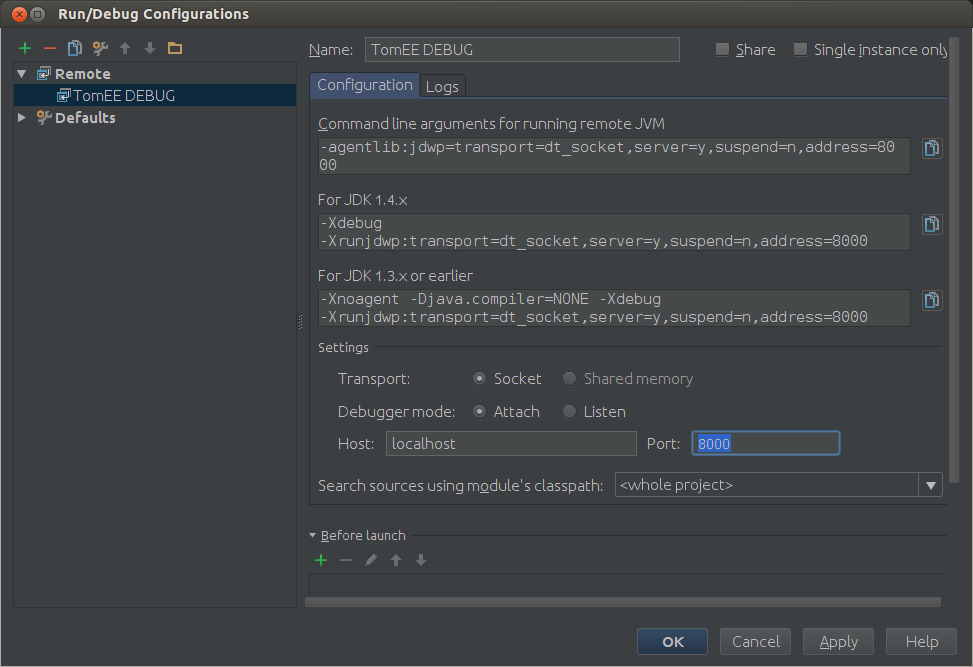

:index-group: IDE
:jbake-date: 2018-12-05
:jbake-type: page
:jbake-status: published

= Debugging an Apache
TomEE App in Intellij IDEA

Stepping through the http://tomee.apache.org/apache-tomee.html[TomEE]
source code is a must-to-follow step if you want to understand how TomEE
works and later contribute. This is a guide to quickly start your
debugging session with TomEE as a TomEE developer.

This guide assumes that:

* Linux is the OS
* IntelliJ IDEA 13.1.3 is the IDE
* Maven 3.0.5 or better is installed

== Download the Source Code

For beginners it is recommended not to start with the trunk, because it
is common to have some blockers or non-stable functionality which could
bring your learning to a halt. So first start with the latest stable
released source code. Move to trunk once you are ready to do some code
modification on TomEE.

http://www.apache.org/dyn/closer.cgi/tomee/tomee-1.7.1/openejb-4.7.1-source-release.zip[Click
here to download TomEE 1.7.1 Source code]

== Build the Source Code

First extract the zip file named *openejb-4.7.1-source-release.zip* to
any location. Lets assume it is your home folder.

_______________________________________
unzip openejb-4.7.1-source-release -d ~
_______________________________________

The above command will create the *openejb-4.7.1* directory in your home
directory.

Even though you can do a full build, We will run the following command
to do a quick build so that you can have your meal before your hunger
kills you.

_________________________________________________________________________________________________________________________________________________
mvn -Pquick -Dsurefire.useFile=false -DdisableXmlReport=true
-DuniqueVersion=false -ff -Dassemble -DskipTests -DfailIfNoTests=false
clean install
_________________________________________________________________________________________________________________________________________________

More details about building the product from the source can be found
http://tomee.apache.org/dev/source-code.html[here].

== Deploy TomEE

The TomEE build builds several distributions (zip & war files) to cater
the different needs of different users. Here we discuss about the tomee
plus distribution & TomEE war distribution only. TomEE+ is the full
feature packed distribution from TomEE.

TomEE+ zip location:

_____________________________________________________________________
~/openejb-4.7.1/tomee/apache-tomee/target/apache-tomee-plus-1.7.1.zip
_____________________________________________________________________

Unzip the zip into your home directory (or any other location)

________________________________________________________________________________
unzip
~/openejb-4.7.1/tomee/apache-tomee/target/apache-tomee-plus-1.7.1.zip -d
~
________________________________________________________________________________

You will find the directory *apache-tomee-plus-1.7.1* in your home
folder. Lets run the TomEE.

__________________________________________________
cd ~/apache-tomee-plus-1.7.1/bin ./catalina.sh run
__________________________________________________

"INFO: Server startup in xxxx ms" is the Green light!

== Prepare your IDE

Lets prepare our IntelliJ IDEA for the debugging session.

Start IntelliJ IDEA and Click the Import Project link

Select the ~/openejb-4.7.1 directory and press OK

Select import project from external model & Maven as the external model.

Press Next on this screen.

Select the main profile.

Select the org.apache.openejb:openejb:4.7.1

image:idea7.png[image]

Select the JDK you want to use with.

Give the project a name and press Finish.

Now your IDE will load the project.

== First Breakpoint

Next step is to put a breakpoint at the place where the code is
triggered. Lets understand how the code is triggered.

TomEE+ is created on top of Tomcat. TomEE registers a Tomcat Lifecycle
Listener *"org.apache.tomee.catalina.ServerListener"* on *server.xml*
file.

All the Tomcat lifecycle events i.e. before_init, after_init, start,
before_stop etc... are received by the *lifecycleEvent* method of the
ServerListener.

The execution of TomEE code starts in this lifecycleEvent method. So the
first breakpoint should be on the lifecycleEvent method.

== Run TomEE+ in debug mode

If you simply run *catalina.sh jpda run* in the bin folder of tomee
deployment, the server starts in the debug mode but it will quckly pass
your breakpoint before you attach your IDE to the server process.

So we set** JPDA_SUSPEND="y"** before we start our debugging. This will
tell the server "Do not proceed until the Debugger tool is attached to
the process"

The convenient way of doing this is adding this line to catalina.sh file
right after the #!/bin/sh line.

________________________________________
= !/bin/sh JPDA_SUSPEND="y"

Now to time to run TomEE+ on debug mode.
________________________________________

__________________________________________________
~/apache-tomee-plus-1.7.1/bin/catalina.sh jpda run
__________________________________________________

The terminal should hang with the message *"Listening for transport
dt_socket at address: 8000"*

== Attach IntelliJ IDEA debugger

* Menu Bar > Run > Edit Configurations
* Press the "*+*" button on the top left corner to get the Add new
configuration menu
* Select "Remote" from the Add new configuration menu
* Give a name (I gave "TomEE DEBUG") to this new configuration and set
the Port to 8000
* Click OK.

To start debugging your TomEE+

Main Menu > Run > Debug TomEE DEBUG

Congratulations! You hit the break point you put at the startup of the
TomEE code. Carry on with your debugging session to learn more.
